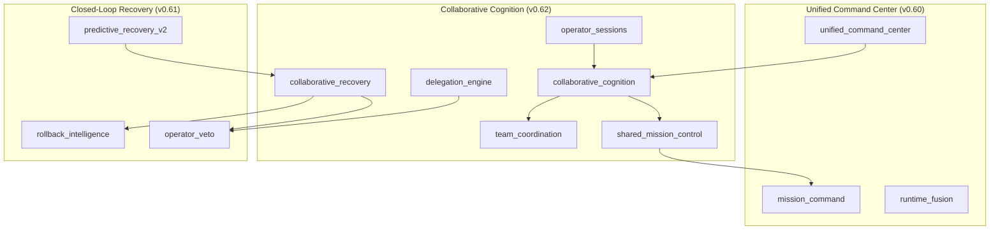
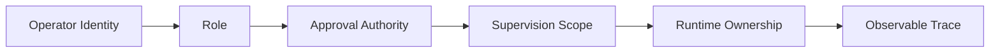
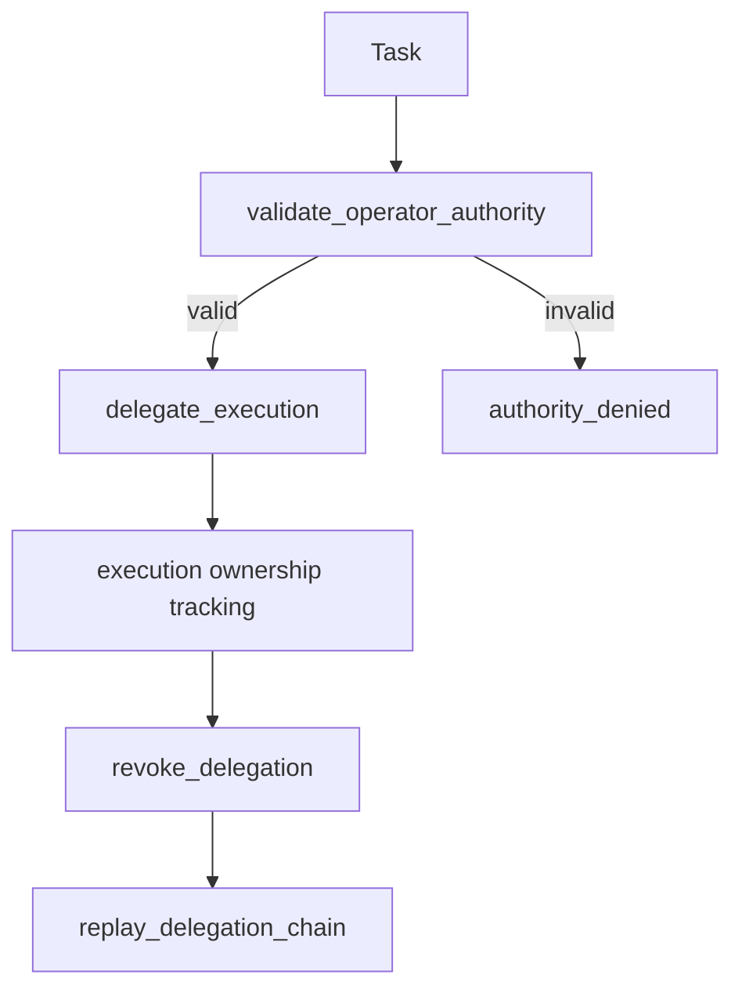
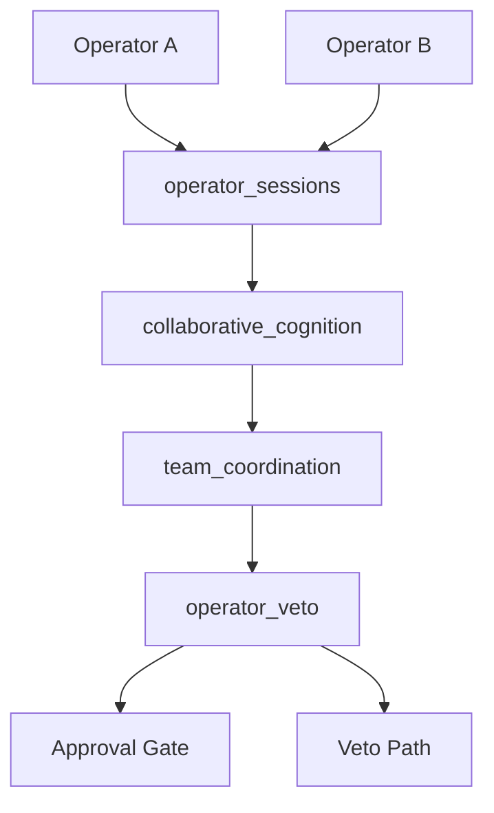
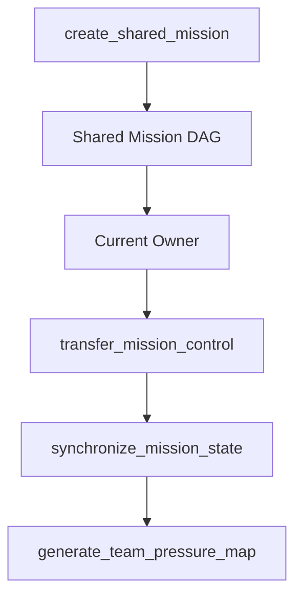
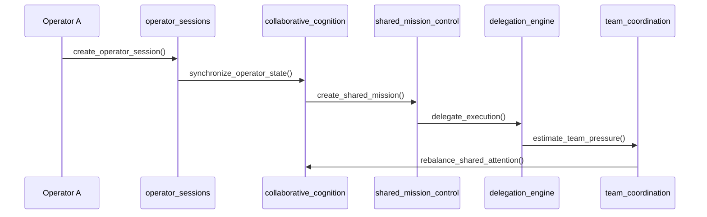

# Odin Runtime

**Collaborative Cognitive Infrastructure Atlas**

Odin Runtime is a local-first collaborative cognitive infrastructure for supervised engineering, orchestration, governance, recovery, and persistent desktop cognition. v0.62 extends Odin from a single-operator command center into a multi-operator collaborative cognition environment with transparent roles, shared mission control, bounded delegation, and supervised collaborative recovery.

---

## Positioning

Odin is a supervised cognitive operating infrastructure for teams and solo operators who need persistent engineering cognition without hidden autonomy. It coordinates command surfaces, missions, recovery, delegation, and operator presence while preserving local-first operation, approval gates, reversibility, and transparent supervision.

Odin does not grant unrestricted multi-user execution, remote control, hidden collaboration, or autonomous authority escalation.

---

## Core Guarantees

| Guarantee | Enforcement |
|-----------|-------------|
| Local-first | Collaboration state persists locally in SQLite-backed registries |
| Permission-aware | Operator roles, authority, and ownership are explicit |
| Approval-gated | Delegation and shared recovery preserve approval routing |
| Observable | Collaboration emits trace events and domain channels |
| Reversible | Delegation revoke, recovery replay, mission control transfer |
| Bounded | Synchronization, rebalance, replay, and DAG limits |
| Backward compatible | Dispatcher semantics and prior runtime separation preserved |

---

## Collaborative Cognition Architecture



---

## Runtime Modules

| Module | App Handle | Role |
|--------|------------|------|
| `collaborative_cognition` | `app.collaborative_cognition` | Multi-operator cognition orchestration and shared attention |
| `operator_sessions` | `app.operator_sessions` | Identity, role, authority, presence, replay |
| `shared_mission_control` | `app.shared_mission_control` | Shared mission DAGs and ownership transfer |
| `delegation_engine` | `app.delegation_engine` | Supervised delegation and authority validation |
| `team_coordination` | `app.team_coordination` | Team pressure, attention balancing, interruption routing |
| `collaborative_recovery` | `app.collaborative_recovery` | Shared recovery authorization and collaborative rollback |

---

## Operator Trust Model



Trust is explicit rather than inferred. Odin records role, authority, focus state, active missions, runtime ownership, and supervision scope.

---

## Delegation Safety Model



Delegation is supervised, approval-aware, reversible, and permission-aware. Revocation preserves operator control.

---

## Multi-Operator Governance



Collaboration does not bypass governance. Operator veto and approval gates remain in the recovery and delegation paths.

---

## Mission Federation



Shared mission control supports ownership transfer, collaborative planning surfaces, and team pressure maps while preserving mission command separation.

---

## Collaboration Lifecycle



---

## Operator Authority Matrix

| Role | Mission Control | Delegation | Recovery Authorization | Veto |
|------|-----------------|------------|------------------------|------|
| `observer` | View | No | No | No |
| `contributor` | Participate | Limited | No | No |
| `supervisor` | Transfer | Yes | Yes | Yes |
| `admin` | Transfer | Yes | Yes | Yes |

The initial runtime uses conservative local roles and keeps remote authority out of scope.

---

## Cinematic Collaboration Surfaces

Placeholders are available in `frontend/cognitive_workspace/src/collaboration/`:

- Multi-operator cognition map
- Shared mission DAG
- Operator constellation
- Delegation flow graph
- Team pressure radar
- Collaborative replay timeline
- Supervision authority overlay
- Collaborative cognition pulse

Supported profiles: `compact`, `balanced`, `immersive`, `cinematic`, `supervisory`.

---

## Streaming Topology

```
runtime (global)
├── collaborative-cognition:runtime
├── operator-sessions:runtime
├── shared-mission-control:runtime
├── delegation-engine:runtime
├── team-coordination:runtime
├── collaborative-recovery:runtime
├── operator-veto:runtime
├── unified-command:runtime
└── ... (collaboration, recovery, command, governance channels)
```

---

## APIs

```
/api/v1/runtime/
├── collaborative-cognition/    # shared cognition state
├── operator-sessions/          # identity, presence, replay
├── shared-mission-control/     # shared DAGs and ownership
├── delegation-engine/          # supervised delegation
├── team-coordination/          # pressure and attention
├── collaborative-recovery/     # shared recovery authorization
├── shared-command/             # command synchronization
├── operator-presence/          # live presence
└── collaboration-replay/       # bounded replay
```

---

## Operator Console

| Page | Purpose |
|------|---------|
| `/collaborative-cognition` | Multi-operator cognition state |
| `/operator-sessions` | Active operator sessions |
| `/shared-missions` | Shared mission control |
| `/team-coordination` | Team coordination snapshot |
| `/delegation-center` | Delegation ownership and revoke |
| `/collaborative-recovery` | Shared recovery supervision |
| `/team-pressure` | Team pressure radar |
| `/shared-command` | Shared command synchronization |
| `/operator-presence` | Operator constellation |
| `/collaboration-replay` | Collaborative replay timeline |

---

## Environment Configuration

```env
ODIN_COLLABORATIVE_COGNITION_ENABLED=1
ODIN_OPERATOR_SESSIONS_ENABLED=1
ODIN_SHARED_MISSION_CONTROL_ENABLED=1
ODIN_DELEGATION_ENGINE_ENABLED=1
ODIN_TEAM_COORDINATION_ENABLED=1
ODIN_COLLABORATIVE_RECOVERY_ENABLED=1
ODIN_COLLABORATION_PROFILE=balanced
ODIN_TEAM_SYNC_MODE=adaptive
ODIN_COLLABORATIVE_RECOVERY_MODE=supervised
```

---

## Runtime Evolution Timeline

| Version | Era | Focus |
|---------|-----|-------|
| v0.49 | Adaptive Autonomous OS | Adaptive runtime and workspace autonomy |
| v0.50 | Real Autonomous Cognitive OS | Native OS and memory fabric v2 |
| v0.51 | Cognitive Infrastructure | Realtime cognition and engineering infrastructure |
| v0.52 | Unified Cognitive Core | Attention engine and scheduler |
| v0.53 | Autonomous Overnight Cognition | Deferred reasoning and morning briefing |
| v0.54 | Native Autonomous Desktop | Window awareness and overlays |
| v0.55 | Autonomous Cognitive Coordination | Objectives and mission continuity |
| v0.56 | Live Cognitive Orchestration | Live streams and mission graph |
| v0.57 | Operational Execution System | Supervised execution pipelines |
| v0.58 | Distributed Cognitive Execution | Multi-workspace execution DAGs |
| v0.59 | Predictive Cognitive Governance | Risk, trust, stabilization |
| v0.60 | Unified Cognitive Command Center | Mission control and runtime fusion |
| v0.61 | Closed-Loop Predictive Recovery | Recovery orchestration and operator veto |
| **v0.62** | **Multi-Operator Collaborative Cognition** | Collaborative cognition and shared supervision |

---

## Scaling Notes

- Operator stream compression
- Adaptive collaboration throttling
- Lazy replay hydration
- Bounded synchronization loops (max 48)
- Collaborative DAG virtualization
- Low-power supervisory mode
- Replay density throttling
- SQLite session retention (500 sessions)

Target hardware remains GTX 1650 Ti, 16GB RAM, and M-series MacBook profiles.

---

## Future Upgrade Path

| Version | Focus |
|---------|-------|
| v0.63 | Real-time rollback DAG animation engine |
| v0.64 | Federated cognition across opt-in workspaces |
| v0.65 | Unified cinematic operational desktop |
| v0.66 | Predictive mission continuity forecasting |
| v0.67 | Persistent collaborative cognition memory fabric |

---

## Safety Statement

Odin v0.62 supports collaboration without granting hidden authority. Every collaborative path remains transparent, permission-aware, approval-gated, observable, reversible, and bounded.

---

<p align="center">
  <strong>Odin Runtime v0.62</strong> — Multi-Operator Collaborative Cognition<br>
  Local-first · Approval-gated · Operator-supervised · Collaborative
</p>
