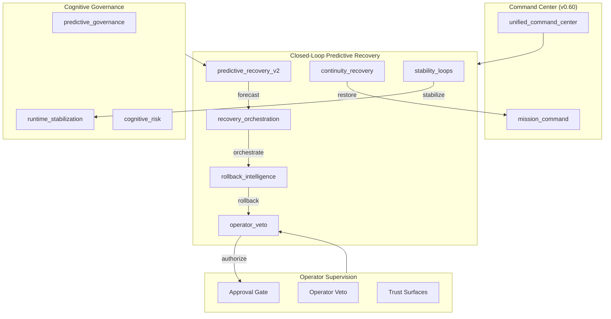
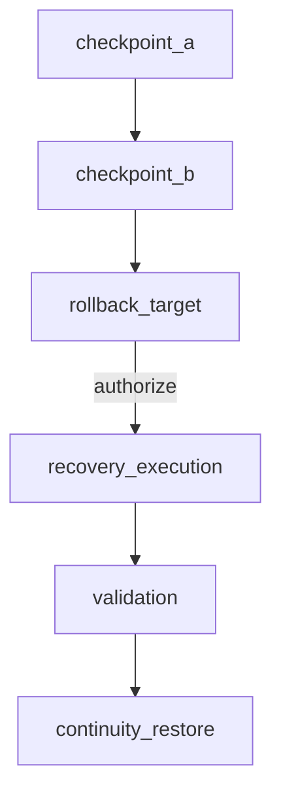
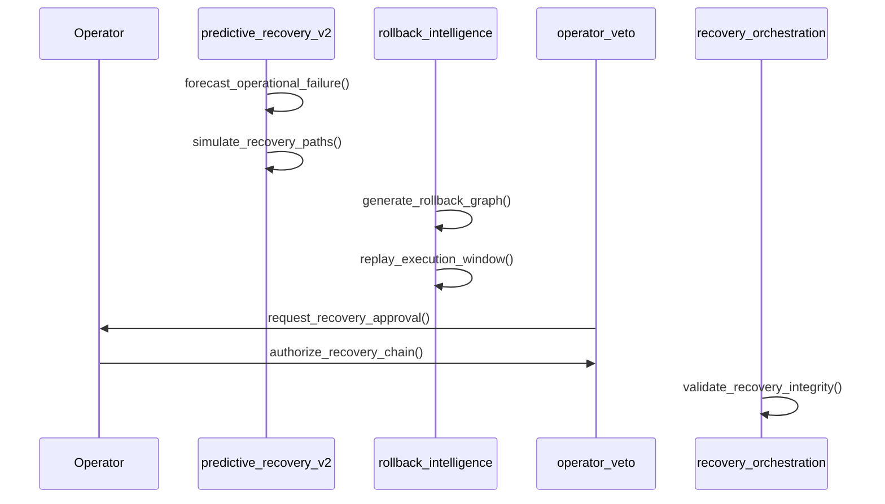
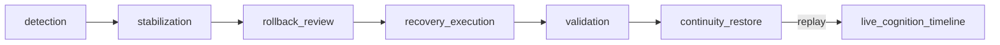
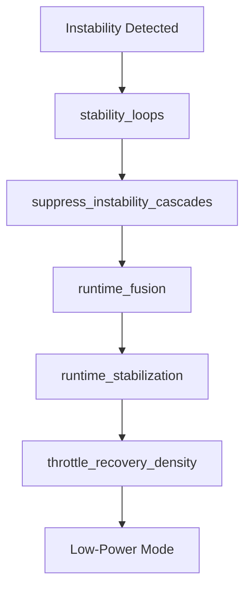
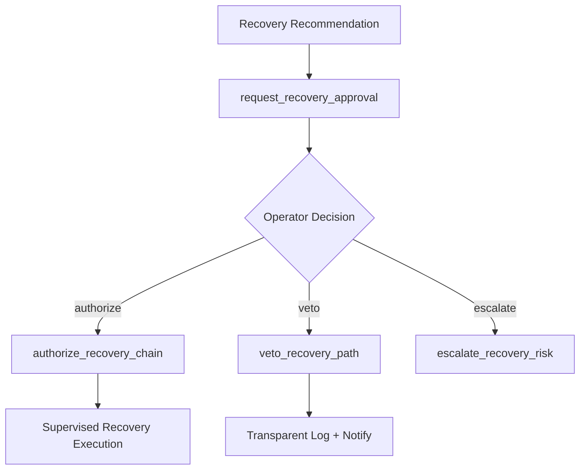
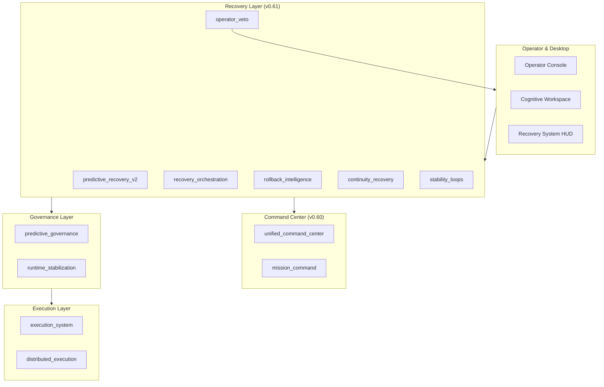

# Odin Runtime

**A supervised cognitive recovery and operational resilience infrastructure.**

Odin Runtime is a local-first cognitive platform — a unified stack of 142+ runtime modules that converge orchestration, execution, governance, recovery, and persistent desktop cognition into one self-stabilizing supervised mission control system on your own hardware.

---

## Vision

Odin gives a single developer a continuously operating cognitive layer that detects instability early, simulates recovery paths, preserves mission continuity, and stabilizes runtime pressure — while every recovery action remains approval-gated, reversible, and operator-supervised.

The system is designed to feel resilient: predictive failure forecasting, rollback DAGs, recovery orchestration dashboards, and trust-preserving veto gates — without hidden rollback execution or unrestricted self-modification.

---

## Why Odin Exists

Most AI tooling fails silently: context is lost, execution is opaque, recovery is manual, and autonomy is either absent or unrestricted. Odin bridges that gap with:

- **Predictive recovery** — failure forecasting, recovery path simulation, probability estimation
- **Supervised rollback** — rollback intelligence, checkpoint selection, operator veto gates
- **Mission continuity** — interrupted workflow recovery, cognition restoration, overnight replay
- **Stability loops** — bounded stabilization, cascade suppression, recovery throttling
- **Unified command center** — orchestration + execution + governance convergence
- **Operator sovereignty** — every recovery action is visible, approval-gated, and reversible

---

## Core Principles

| Principle | Implementation |
|-----------|----------------|
| Local-first | All cognition, recovery, and monitoring stay on-device |
| Approval-gated rollback | All recovery execution routes through `operator_veto` |
| Bounded stabilization | Recovery cycles, replay loops, and simulation limits |
| Transparent intervention | All risk, trust, and recovery scoring is operator-visible |
| Reversible recovery | Checkpoints, rollback graphs, continuity replay chains |
| Incremental architecture | New releases extend; they do not rewrite |
| Backward compatible | Dispatcher semantics and streaming contracts preserved |

---

## Recovery Orchestration Architecture (v0.61)



No autonomous destructive recovery. No hidden rollback execution. No unsupervised intervention.

---

## Recovery Modules

| Module | App Handle | Role |
|--------|-----------|------|
| `predictive_recovery_v2` | `app.predictive_recovery_v2` | Failure forecasting, recovery simulation, probability estimation |
| `recovery_orchestration` | `app.recovery_orchestration` | Supervised recovery coordination, phase transitions |
| `rollback_intelligence` | `app.rollback_intelligence` | Rollback graph generation, replay analysis, confidence scoring |
| `continuity_recovery` | `app.continuity_recovery` | Mission continuity, workspace rebuild, cognition restoration |
| `stability_loops` | `app.stability_loops` | Bounded stabilization, cascade suppression, recovery throttling |
| `operator_veto` | `app.operator_veto` | Recovery approval routing, veto chain management |

---

## Rollback DAG Example



Rollback intelligence generates virtualized DAGs (600 node cap). All rollback execution requires operator authorization.

---

## Recovery Replay Lifecycle



Bounded replay loops (max 40). Lazy replay hydration. Adaptive replay compression.

---

## Continuity Restoration Flow



Continuity recovery integrates with `mission_command`, `mission_continuity`, `deferred_reasoning`, and `live_cognition_timeline`.

---

## Instability Suppression Graph



Bounded stabilization loops (max 48). Recovery cooldown scheduling.

---

## Operator Veto Routing



All recovery execution must route through `operator_veto`. Trust-preserving escalation.

---

## Checkpoint Recovery Chain

```
Failure Forecast → Recovery Simulation → Rollback Graph → Operator Approval
        │                    │                  │                │
        ▼                    ▼                  ▼                ▼
   Risk Surface      Recovery Paths      Checkpoint Select    Veto Gate
        │                    │                  │                │
        └────────────────────┴──────────────────┴────────────────┘
                                    │
                                    ▼
                          Supervised Recovery Execution
                                    │
                                    ▼
                          Continuity Restoration
```

---

## Stabilization Loop Topology

```
stability-loops:runtime
├── initialize_stability_loop()
├── rebalance_runtime_pressure()
├── throttle_recovery_density()
└── suppress_instability_cascades()
    ├── runtime_stabilization
    ├── unified_command_center
    └── runtime_fusion
```

---

## Unified Stream Topology

```
runtime (global)
├── predictive-recovery-v2:runtime
├── recovery-orchestration:runtime
├── rollback-intelligence:runtime
├── continuity-recovery:runtime
├── stability-loops:runtime
├── operator-veto:runtime
├── unified-command:runtime
├── predictive-governance:runtime
└── ... (62+ domain channels)
```

---

## Runtime Evolution Timeline

| Version | Era | Focus |
|---------|-----|-------|
| v0.56 | Live Cognitive Orchestration | Live streams, mission graph |
| v0.57 | Operational Execution System | Supervised pipelines |
| v0.58 | Distributed Cognitive Execution | Multi-workspace DAG federation |
| v0.59 | Predictive Cognitive Governance | Risk forecasting, trust surfaces |
| v0.60 | Unified Cognitive Command Center | Mission control, runtime fusion |
| **v0.61** | **Closed-Loop Predictive Recovery** | Recovery orchestration, operator veto |

---

## Full System Architecture



---

## Local-First Architecture

| Guarantee | Detail |
|-----------|--------|
| On-device processing | Cognition, recovery, governance, window tracking |
| No cloud requirement | Mock provider works fully offline |
| Transparent monitoring | All recovery runtimes expose `operator_visible: true` |
| Bounded retention | SQLite rollback registry (600 nodes), timeline (500 events) |
| Reversible state | Checkpoints across execution, recovery, and workflows |

---

## Performance Profiles

| Profile | Recovery | Rendering | Use Case |
|---------|----------|-----------|----------|
| `compact` | Low | Minimal | Background, low-power |
| `balanced` | Medium | Adaptive | Daily development |
| `immersive` | High | Full | Deep work |
| `cinematic` | High | Maximum | Visual surfaces |
| `overnight_recovery` | Bounded | Low-power | Idle recovery cycles |

---

## Hardware Targets

| Profile | GPU | RAM | Recommended Mode |
|---------|-----|-----|------------------|
| Minimum | GTX 1650 Ti | 16 GB | `compact` / `balanced` |
| Recommended | RTX 3060+ | 32 GB | `balanced` / `immersive` |
| Apple Silicon | M-series | 16 GB | `balanced` |

Adaptive recovery throttling, lazy replay hydration, and bounded stabilization loops ensure operation within constraints.

---

## Installation

```bash
git clone https://github.com/FrostXMello/odin-runtime.git
cd odin-runtime/odin
cp backend/.env.example backend/.env
```

### Backend

```powershell
.\scripts\start-backend.ps1
```

### Operator Console

```powershell
cd operator
npm install
npm run dev
```

---

## Quick Start

```env
# Enable recovery + command center core
ODIN_PREDICTIVE_RECOVERY_V2_ENABLED=1
ODIN_RECOVERY_ORCHESTRATION_ENABLED=1
ODIN_ROLLBACK_INTELLIGENCE_ENABLED=1
ODIN_CONTINUITY_RECOVERY_ENABLED=1
ODIN_STABILITY_LOOPS_ENABLED=1
ODIN_OPERATOR_VETO_ENABLED=1
ODIN_UNIFIED_COMMAND_CENTER_ENABLED=1
```

1. Start backend and operator console
2. Open `/predictive-recovery-v2` for failure forecasting
3. Open `/recovery-orchestration` for supervised recovery coordination
4. Open `/operator-veto` for recovery approval routing
5. Stream recovery events on `predictive-recovery-v2:runtime`

---

## Environment Configuration

```env
ODIN_PREDICTIVE_RECOVERY_V2_ENABLED=1
ODIN_RECOVERY_ORCHESTRATION_ENABLED=1
ODIN_ROLLBACK_INTELLIGENCE_ENABLED=1
ODIN_CONTINUITY_RECOVERY_ENABLED=1
ODIN_STABILITY_LOOPS_ENABLED=1
ODIN_OPERATOR_VETO_ENABLED=1
ODIN_RECOVERY_PROFILE=balanced
ODIN_RECOVERY_DENSITY=adaptive
ODIN_STABILITY_MODE=balanced
```

---

## API Structure

```
/api/v1/runtime/
├── predictive-recovery-v2/    # Failure forecasting
├── recovery-orchestration/    # Recovery coordination
├── rollback-intelligence/   # Rollback graphs
├── continuity-recovery/     # Mission continuity
├── stability-loops/         # Stabilization loops
├── operator-veto/           # Recovery approval
├── unified-command/         # Command center
└── ... (120+ route groups)
```

---

## Operator Console

270+ pages for runtime visibility. Key recovery surfaces:

| Page | Purpose |
|------|---------|
| `/predictive-recovery-v2` | Failure forecasting and simulation |
| `/recovery-orchestration` | Supervised recovery coordination |
| `/recovery-phases` | Recovery phase transitions |
| `/rollback-intelligence` | Rollback graph generation |
| `/rollback-replay` | Execution window replay |
| `/continuity-recovery` | Mission continuity restoration |
| `/stability-loops` | Bounded stabilization loops |
| `/runtime-stability` | Instability cascade suppression |
| `/operator-veto` | Recovery approval routing |
| `/recovery-authorization` | Supervised rollback authorization |

---

## Safety Guarantees

| Guarantee | Enforcement |
|-----------|-------------|
| No hidden rollback | All recovery returns `transparent: true` |
| Approval-gated | `approval_gated: true` on all recovery paths |
| Operator veto | All execution routes through `operator_veto` |
| Reversible | Checkpoints, rollback graphs, replay chains |
| Bounded cycles | Max limits on recovery, replay, stabilization loops |
| Local-only | `local_first: true` on all recovery subsystems |

---

## Scaling Constraints

- Rollback DAG virtualization (600 node cap)
- Adaptive replay compression
- Bounded recovery cycles (max 48)
- Recovery cooldown scheduling
- Stabilization density throttling
- Low-power replay rendering
- Stream prioritization under instability
- Lazy continuity hydration

---

## Runtime Feature Matrix

| Feature | v0.59 | v0.60 | v0.61 |
|---------|-------|-------|-------|
| Predictive governance | ✅ | ✅ | ✅ |
| Unified command center | — | ✅ | ✅ |
| Predictive recovery v2 | — | — | ✅ |
| Recovery orchestration | — | — | ✅ |
| Rollback intelligence | — | — | ✅ |
| Operator veto gates | — | — | ✅ |
| Stability loops | — | — | ✅ |

---

## Roadmap (v0.62+)

| Version | Focus |
|---------|-------|
| v0.62 | Multi-operator collaborative cognition |
| v0.63 | Real-time rollback DAG animation engine |
| v0.64 | Federated cognition across opt-in workspaces |
| v0.65 | Unified cinematic operational desktop |
| v0.66 | Predictive mission continuity forecasting |

---

## Contributing

1. Fork the repository
2. Create a feature branch from `master`
3. Extend incrementally — do not rewrite dispatcher semantics
4. Add tests via `gen_p{N}_tests.py` pattern
5. Document in `docs/`
6. Submit a pull request

---

## License

See [LICENSE](LICENSE) in the repository root.

---

<p align="center">
  <strong>Odin Runtime v0.61</strong> — Closed-Loop Predictive Recovery<br>
  Local-first · Approval-gated · Operator-supervised · Resilient
</p>
