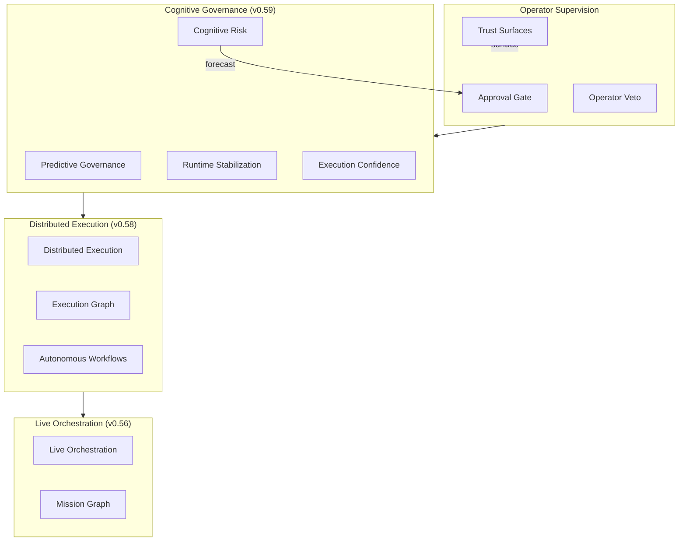
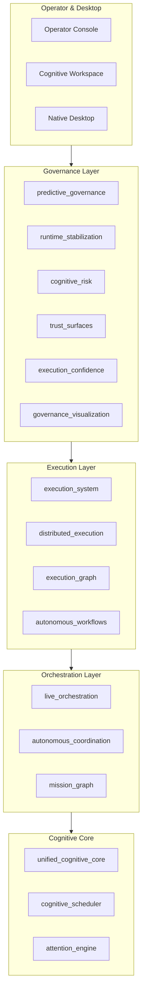

# Odin Runtime

**A supervised cognitive operating infrastructure for autonomous engineering, execution orchestration, and persistent desktop cognition.**

Odin Runtime is a local-first cognitive operating platform — an orchestrated stack of 130+ runtime modules that coordinate reasoning, execution, governance, memory, missions, and desktop awareness on your own hardware.

---

## Vision

Odin gives a single developer a continuously operating cognitive layer: one that remembers context across sessions, coordinates long-horizon work across multiple workspaces, executes supervised engineering pipelines, and governs cognition — without cloud dependency or unsupervised autonomy.

The system is designed to feel alive: live orchestration, execution DAGs, governance HUDs, and cinematic operator surfaces — while remaining bounded, reversible, approval-gated, and operator-supervised.

---

## Why Odin Exists

Most AI tooling is ephemeral: chat sessions vanish, context resets, execution is opaque, and autonomy is either absent or unrestricted. Odin bridges that gap with:

- **Persistent cognition** — sessions, objectives, mission graphs, execution memory
- **Supervised execution** — reversible pipelines, checkpoints, rollback graphs
- **Governed autonomy** — predictive stabilization, risk forecasting, trust surfaces
- **Desktop integration** — window awareness, overlays, workspace sessions
- **Operator sovereignty** — every action is visible, approval-gated, and reversible

---

## Core Principles

| Principle | Implementation |
|-----------|----------------|
| Local-first | All cognition, memory, governance, and monitoring stay on-device |
| Approval-gated | Destructive actions require explicit operator approval |
| Bounded cognition | Reasoning budgets, cycle limits, throttling, cooldowns |
| Transparent governance | All risk, trust, and confidence scoring is operator-visible |
| Reversible execution | Checkpoints, rollback graphs, execution replay chains |
| Incremental architecture | New releases extend; they do not rewrite |
| Backward compatible | Dispatcher semantics and streaming contracts preserved |

---

## Safety & Governance Model



No unrestricted autonomy. No hidden execution. No self-authoritative governance. No autonomous deployment.

---

## Local-First Architecture

| Guarantee | Detail |
|-----------|--------|
| On-device processing | Cognition, memory, governance, window tracking |
| No cloud requirement | Mock provider works fully offline |
| Transparent monitoring | All awareness runtimes expose `operator_visible: true` |
| Configurable exclusions | Window and workspace exclusion lists |
| Bounded retention | SQLite stores capped per subsystem |
| Reversible state | Checkpoints across execution, governance, and workflows |

---

## Runtime Evolution Timeline

| Version | Era | Focus |
|---------|-----|-------|
| v0.49 | Adaptive Autonomous OS | Adaptive runtime, autonomous workspace |
| v0.50 | Real Autonomous Cognitive OS | Native OS, memory fabric v2 |
| v0.51 | Cognitive Infrastructure | Realtime cognition, engineering infra |
| v0.52 | Unified Cognitive Core | Attention engine, cognitive scheduler |
| v0.53 | Autonomous Overnight Cognition | Deferred reasoning, morning briefing |
| v0.54 | Native Autonomous Desktop | Window awareness, live overlays |
| v0.55 | Autonomous Cognitive Coordination | Objectives, context sync |
| v0.56 | Live Cognitive Orchestration | Live streams, mission graph |
| v0.57 | Operational Execution System | Supervised pipelines, agent collaboration |
| v0.58 | Distributed Cognitive Execution | Multi-workspace DAG federation |
| **v0.59** | **Predictive Cognitive Governance** | Risk forecasting, trust surfaces, stabilization |

---

## Full System Architecture



---

## Cognitive Governance Layer

| Module | App Handle | Role |
|--------|-----------|------|
| `predictive_governance` | `app.predictive_governance` | Governance cycles, pressure balancing |
| `runtime_stabilization` | `app.runtime_stabilization` | Instability suppression, cooldowns |
| `cognitive_risk` | `app.cognitive_risk` | Risk forecasting, failure simulation |
| `trust_surfaces` | `app.trust_surfaces` | Operator trust, supervision integrity |
| `execution_confidence` | `app.execution_confidence` | Confidence scoring, workflow probability |
| `governance_visualization` | `app.governance_visualization` | Governance HUD, risk heatmaps |

---

## Distributed Execution Layer

- **Execution system** — supervised pipelines with reversible checkpoints
- **Execution graph** — SQLite DAG registry with rollback graphs
- **Distributed execution** — cross-workspace pipeline federation
- **Predictive recovery** — blocker forecasting and recovery simulation
- **Autonomous workflows** — bounded supervised automation loops (max 48 cycles)

---

## Desktop Cognition Layer

- Window awareness (local, exclusion-aware)
- Live overlays v2 (adaptive throttling)
- Workspace sessions (SQLite restore chains)
- Operator focus (distraction pressure)
- Desktop attention (salience scoring)

---

## Overnight Cognition

Bounded overnight cycles with deferred reasoning, continuity forecasting, morning briefing, and cognitive maintenance. Limits: `ODIN_OVERNIGHT_MAX_CYCLES=32`. No autonomous deployment.

---

## Mission Orchestration

Objective trees, mission graphs, resume chains, and continuity scoring across sessions. All mission state is supervised and locally persisted.

---

## Autonomous Workflows

Bounded automation loops with checkpointing and stabilization. `no_auto_deploy: true` on all workflow continuation. Operator override required for escalation.

---

## Operator Supervision Model

```
Cognition → Governance Check → Risk Forecast → Trust Surface
                                    │
                                    ▼
                            Approval Gate
                                    │
                    ┌───────────────┼───────────────┐
                    ▼               ▼               ▼
                Execute         Defer           Reject
                    │               │               │
                    ▼               ▼               ▼
              Checkpoint      Queue           Log + Notify
```

---

## Streaming Architecture

### Stream Topology

```
runtime (global)
├── predictive-governance:runtime
├── runtime-stabilization:runtime
├── cognitive-risk:runtime
├── trust-surfaces:runtime
├── execution-confidence:runtime
├── governance-visualization:runtime
├── distributed-execution:runtime
├── execution-graph:runtime
├── live-orchestration:runtime
└── ... (50+ domain channels)
```

Events flow through `resolve_channels_for_trace()` without breaking dispatcher semantics.

---

## Native Desktop Integration

Tray coordination, native notifications, low-power mode, window classification, and workspace session restore. See `docs/NATIVE_DESKTOP_RUNTIME.md`.

---

## Performance Profiles

| Profile | Cognition | Rendering | Use Case |
|---------|-----------|-----------|----------|
| `compact` | Low | Minimal | Background, low-power |
| `balanced` | Medium | Adaptive | Daily development |
| `engineering_operations` | High | Standard | Active coding |
| `immersive` | High | Full | Deep work |
| `cinematic` | High | Maximum | Visual surfaces |
| `overnight_governance` | Bounded | Low-power | Idle governance cycles |

---

## Hardware Targets

| Profile | GPU | RAM | Recommended Mode |
|---------|-----|-----|------------------|
| Minimum | GTX 1650 Ti | 16 GB | `compact` / `balanced` |
| Recommended | RTX 3060+ | 32 GB | `balanced` / `immersive` |
| Apple Silicon | M-series | 16 GB | `balanced` |

Adaptive governance throttling, lazy visualization hydration, and bounded simulation loops ensure operation within constraints.

---

## Installation

### Prerequisites

- Python 3.11+
- Node.js 18+
- Redis (optional)
- 16 GB RAM recommended

```bash
git clone https://github.com/FrostXMello/odin-runtime.git
cd odin-runtime/odin
cp backend/.env.example backend/.env
```

### Backend

```powershell
.\scripts\start-backend.ps1
```

API docs: http://127.0.0.1:8000/docs

### Operator Console

```powershell
cd operator
npm install
npm run dev
```

---

## Quick Start

```env
# Enable governance + execution core
ODIN_PREDICTIVE_GOVERNANCE_ENABLED=1
ODIN_RUNTIME_STABILIZATION_ENABLED=1
ODIN_DISTRIBUTED_EXECUTION_ENABLED=1
ODIN_EXECUTION_SYSTEM_ENABLED=1
ODIN_LIVE_ORCHESTRATION_ENABLED=1
```

1. Start backend and operator console
2. Open `/predictive-governance` for governance health
3. Open `/execution-system` for supervised pipelines
4. Stream governance events on `predictive-governance:runtime`

---

## Environment Configuration

See `backend/.env.example` for all flags. Key governance flags:

```env
ODIN_PREDICTIVE_GOVERNANCE_ENABLED=1
ODIN_COGNITIVE_RISK_ENABLED=1
ODIN_TRUST_SURFACES_ENABLED=1
ODIN_GOVERNANCE_PROFILE=balanced
ODIN_RISK_FORECASTING_MODE=adaptive
ODIN_RUNTIME_STABILIZATION_MODE=balanced
```

---

## API Structure

```
/api/v1/runtime/
├── predictive-governance/     # Governance cycles
├── runtime-stabilization/     # Instability suppression
├── cognitive-risk/            # Risk forecasting
├── trust-surfaces/            # Trust scoring
├── execution-confidence/      # Confidence estimation
├── governance-visualization/  # HUD rendering
├── distributed-execution/     # Cross-workspace federation
├── execution-graph/           # DAG management
├── execution-system/          # Supervised pipelines
├── live-orchestration/        # Live orchestration
└── ... (100+ route groups)
```

---

## Operator Console

250+ pages for runtime visibility. Key governance surfaces:

| Page | Purpose |
|------|---------|
| `/predictive-governance` | Governance cycle health |
| `/runtime-stabilization` | Instability suppression |
| `/cognitive-risk` | Risk forecasting |
| `/trust-surfaces` | Operator trust scoring |
| `/execution-confidence` | Workflow probability |
| `/governance-visualization` | Governance HUD |

---

## Safety Guarantees

| Guarantee | Enforcement |
|-----------|-------------|
| No hidden execution | All runtimes return `transparent: true` |
| No auto-deploy | `no_auto_deploy: true` on workflows |
| Approval-gated | `approval_gated: true` on execution and simulation |
| Reversible | Checkpoints, rollback graphs, replay chains |
| Bounded cycles | Max limits on loops, streams, simulations |
| Operator override | `operator_override: true` on alignment and intervention |
| Local-only | `local_first: true` on awareness and federation |

---

## Scaling Constraints

- Adaptive governance throttling
- Runtime cooldowns (stabilization, federation, workflows)
- Lazy visualization hydration
- Low-power governance mode
- Bounded risk simulation loops (max 36)
- Governance stream compression
- DAG virtualization (400 node cap)
- SQLite retention limits per subsystem

---

## Runtime Feature Matrix

| Feature | v0.56 | v0.57 | v0.58 | v0.59 |
|---------|-------|-------|-------|-------|
| Live orchestration | ✅ | ✅ | ✅ | ✅ |
| Supervised execution | — | ✅ | ✅ | ✅ |
| Distributed DAG | — | — | ✅ | ✅ |
| Predictive governance | — | — | — | ✅ |
| Risk forecasting | — | — | — | ✅ |
| Trust surfaces | — | — | — | ✅ |
| Runtime stabilization | — | — | — | ✅ |

---

## Roadmap (v0.60+)

| Version | Focus |
|---------|-------|
| v0.60 | Unified governance + execution + orchestration dashboard |
| v0.61 | Closed-loop predictive recovery with operator veto gates |
| v0.62 | Multi-operator team governance (shared trust surfaces) |
| v0.63 | Real-time DAG visualization with live rollback animation |
| v0.64 | Federated governance across opt-in workspace boundaries |

---

## Contributing

1. Fork the repository
2. Create a feature branch from `master`
3. Extend incrementally — do not rewrite dispatcher semantics
4. Add tests via `gen_p{N}_tests.py` pattern
5. Document in `docs/`
6. Submit a pull request

---

## License

See [LICENSE](LICENSE) in the repository root.

---

<p align="center">
  <strong>Odin Runtime v0.59</strong> — Predictive Cognitive Governance<br>
  Local-first · Approval-gated · Operator-supervised · Governed
</p>
