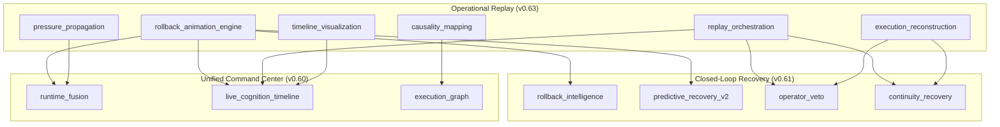
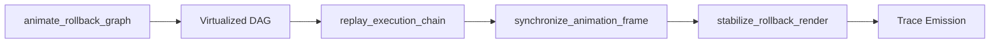
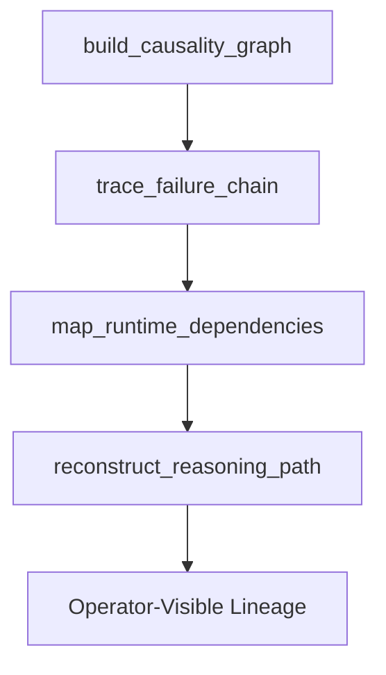
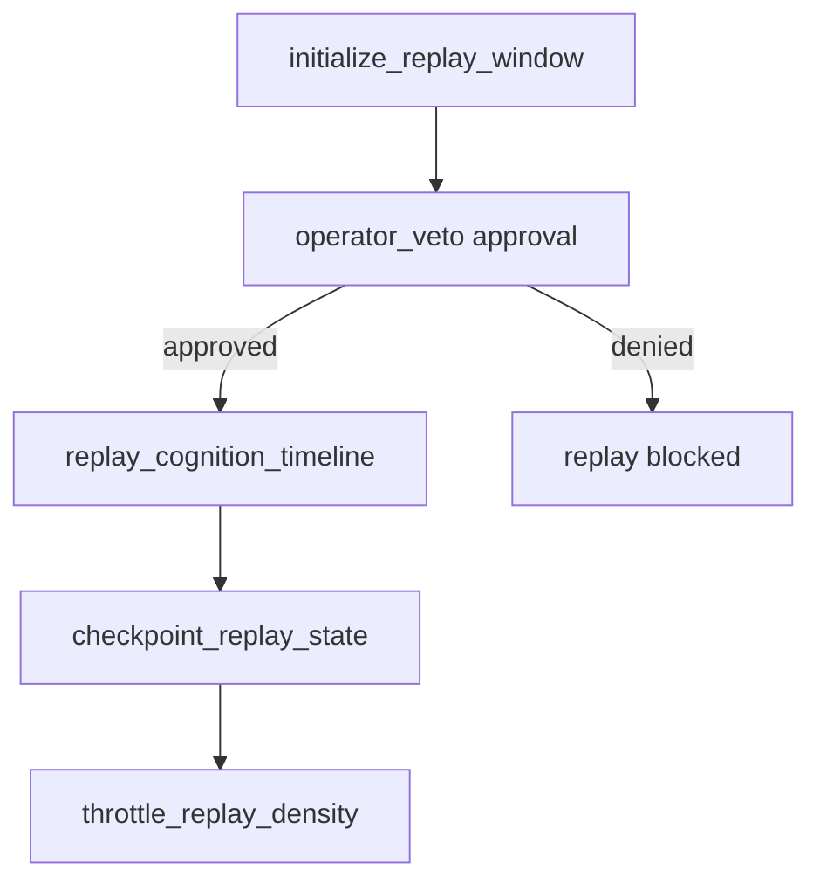
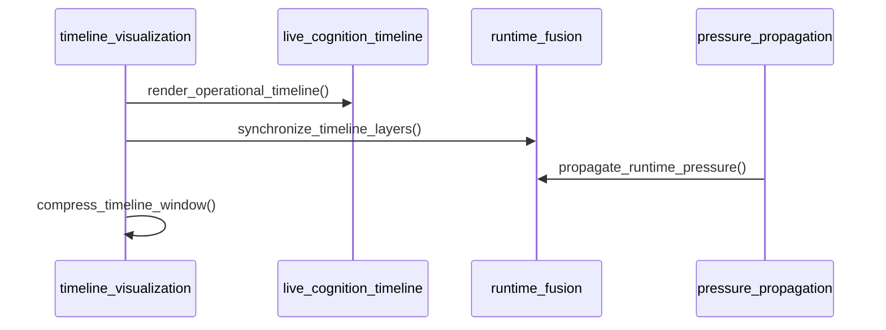
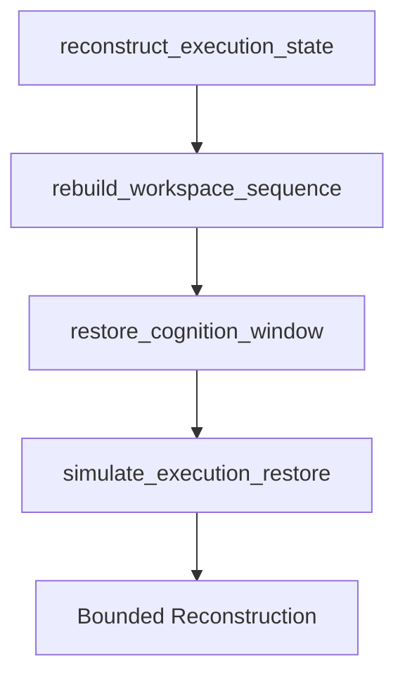

# Odin Runtime

**Operational Replay & Recovery Infrastructure Atlas**

Odin Runtime is a local-first operational replay and recovery infrastructure for supervised engineering cognition. v0.63 transforms Odin's rollback/recovery stack into a fully visualized, continuously replayable operational timeline system with live DAG animation, execution playback, causality mapping, and cinematic cognition replay.

---

## Positioning

Odin is a supervised cognitive operating infrastructure for operators who need persistent engineering cognition with transparent rollback, replay, and recovery — without hidden autonomy or unrestricted system control. It coordinates rollback DAG animation, causality lineage, replay orchestration, pressure propagation, timeline visualization, and execution reconstruction while preserving local-first operation, approval gates, reversibility, and operator-transparent supervision.

Odin does not grant autonomous destructive rollback, hidden execution replay, unrestricted system control, or unsafe replay mutation.

---

## Core Guarantees

| Guarantee | Enforcement |
|-----------|-------------|
| Local-first | Replay state persists locally in SQLite-backed registries |
| Replay transparency | All replay paths emit trace events and domain channels |
| Approval-gated replay | `operator_veto` coordinates replay authorization |
| Bounded cognition | Replay loops (max 56), reconstruction loops (max 40) |
| Reversible restoration | Checkpoint routing and simulate-only restore paths |
| Operator-visible lineage | Causality mapping and failure-chain tracing |
| No unrestricted rollback | Supervised animation without destructive mutation |
| Backward compatible | Dispatcher semantics and prior runtime separation preserved |

---

## Replay Architecture



---

## Runtime Modules

| Module | App Handle | Role |
|--------|------------|------|
| `rollback_animation_engine` | `app.rollback_animation_engine` | Live rollback DAG animation and execution chain playback |
| `causality_mapping` | `app.causality_mapping` | Causal execution graphing and failure-chain linkage |
| `replay_orchestration` | `app.replay_orchestration` | Replay coordination and bounded cognition playback |
| `pressure_propagation` | `app.pressure_propagation` | Runtime pressure diffusion and congestion detection |
| `timeline_visualization` | `app.timeline_visualization` | Cinematic operational timelines and cognition replay |
| `execution_reconstruction` | `app.execution_reconstruction` | Bounded execution state reconstruction |

---

## Rollback DAG Visualization Flow



Rollback DAGs are virtualized (800 node cap), animated in real time, and synchronized with bounded replay loops.

---

## Causality Lineage System



Causality mapping reconstructs failure chains and cross-runtime dependencies with transparent reasoning paths.

---

## Replay Supervision Model



All replay behavior remains supervised, approval-gated, and operator-transparent.

---

## Timeline Synchronization



---

## Operational Continuity Model



Execution reconstruction preserves workspace continuity without unsafe replay mutation.

---

## Bounded Replay Guarantees

| Limit | Value |
|-------|-------|
| Rollback DAG nodes | 800 (virtualized) |
| Replay loops | 56 max |
| Reconstruction loops | 40 max |
| Animation frames (SQLite) | 500 retention |
| Replay checkpoints | 40 rolling |

---

## Cinematic Replay Surfaces

Placeholders in `frontend/cognitive_workspace/src/rollback_visualization/`:

- Live rollback DAG renderer
- Cinematic replay engine
- Causality graph explorer
- Runtime pressure globe
- Cognition replay river
- Execution reconstruction viewer
- Replay synchronization HUD
- Timeline compression controls
- Rollback stabilization radar

Supported profiles: `compact`, `balanced`, `immersive`, `cinematic`, `overnight_replay`.

---

## Streaming Topology

```
runtime (global)
├── rollback-animation:runtime
├── causality-mapping:runtime
├── replay-orchestration:runtime
├── pressure-propagation:runtime
├── timeline-visualization:runtime
├── execution-reconstruction:runtime
├── rollback-intelligence:runtime
├── operator-veto:runtime
└── ... (recovery, command, collaboration channels)
```

---

## APIs

```
/api/v1/runtime/
├── rollback-animation/         # DAG animation and replay
├── causality-mapping/          # causality graphs and failure chains
├── replay-orchestration/       # replay windows and throttling
├── pressure-propagation/       # pressure diffusion and congestion
├── timeline-visualization/     # timeline render and compression
├── execution-reconstruction/   # state reconstruction and restore
├── rollback-dag-live/          # live DAG endpoint
├── execution-replay/           # execution chain replay
├── failure-lineage/            # failure chain tracing
├── runtime-dependencies/       # dependency mapping
├── pressure-diffusion/         # diffusion simulation
└── cognition-timeline/         # cognition replay river
```

---

## Operator Console

| Page | Purpose |
|------|---------|
| `/rollback-animation` | Rollback animation engine |
| `/rollback-dag-live` | Live rollback DAG renderer |
| `/execution-replay` | Supervised execution chain playback |
| `/causality-mapping` | Causal execution graph explorer |
| `/failure-lineage` | Failure-chain tracing |
| `/runtime-dependencies` | Cross-runtime dependency map |
| `/replay-orchestration` | Replay coordination and checkpoints |
| `/pressure-propagation` | Runtime pressure surfaces |
| `/pressure-diffusion` | Pressure diffusion simulation |
| `/timeline-visualization` | Cinematic operational timelines |
| `/cognition-timeline` | Cognition replay river |
| `/execution-reconstruction` | Execution state reconstruction |

---

## Environment Configuration

```env
ODIN_ROLLBACK_ANIMATION_ENGINE_ENABLED=1
ODIN_CAUSALITY_MAPPING_ENABLED=1
ODIN_REPLAY_ORCHESTRATION_ENABLED=1
ODIN_PRESSURE_PROPAGATION_ENABLED=1
ODIN_TIMELINE_VISUALIZATION_ENABLED=1
ODIN_EXECUTION_RECONSTRUCTION_ENABLED=1
ODIN_REPLAY_PROFILE=balanced
ODIN_REPLAY_DENSITY=adaptive
ODIN_TIMELINE_RENDER_MODE=adaptive
```

---

## Hardware Scaling Matrix

| Profile | GTX 1650 Ti | 16GB RAM | M-series MacBook |
|---------|-------------|----------|------------------|
| `compact` | Adaptive FPS 15 | Low memory footprint | Battery-aware throttling |
| `balanced` | Adaptive FPS 30 | Standard replay hydration | Standard timeline render |
| `immersive` | DAG virtualization | Layer compression | Multi-layer sync |
| `cinematic` | Render throttling | Timeline compression | Continuity overlays |
| `overnight_replay` | Low-power mode | Lazy hydration | Cooldown scheduling |

---

## Runtime Evolution Timeline

| Version | Era | Focus |
|---------|-----|-------|
| v0.49 | Adaptive Autonomous OS | Adaptive runtime and workspace autonomy |
| v0.50 | Real Autonomous Cognitive OS | Native OS and memory fabric v2 |
| v0.51 | Cognitive Infrastructure | Realtime cognition and engineering infrastructure |
| v0.52 | Unified Cognitive Core | Attention engine and scheduler |
| v0.53 | Autonomous Overnight Cognition | Deferred reasoning and morning briefing |
| v0.54 | Native Autonomous Desktop | Window awareness and overlays |
| v0.55 | Autonomous Cognitive Coordination | Objectives and mission continuity |
| v0.56 | Live Cognitive Orchestration | Live streams and mission graph |
| v0.57 | Operational Execution System | Supervised execution pipelines |
| v0.58 | Distributed Cognitive Execution | Multi-workspace execution DAGs |
| v0.59 | Predictive Cognitive Governance | Risk, trust, stabilization |
| v0.60 | Unified Cognitive Command Center | Mission control and runtime fusion |
| v0.61 | Closed-Loop Predictive Recovery | Recovery orchestration and operator veto |
| v0.62 | Multi-Operator Collaborative Cognition | Collaborative cognition and shared supervision |
| **v0.63** | **Real-Time Rollback DAG Animation Engine** | Operational replay and recovery visualization |

---

## Scaling Notes

- Rollback DAG virtualization (800 node cap)
- Bounded replay loops (max 56)
- Bounded reconstruction loops (max 40)
- Adaptive replay compression
- Replay density throttling
- Timeline render throttling
- Low-power cinematic rendering
- Visualization cooldown scheduling
- SQLite replay retention limits (500 frames)
- Lazy replay hydration
- Stream prioritization

Target hardware: GTX 1650 Ti, 16GB RAM, M-series MacBook.

---

## Future Upgrade Path

| Version | Focus |
|---------|-------|
| v0.64 | Federated cognition across opt-in workspaces |
| v0.65 | Unified cinematic operational desktop |
| v0.66 | Predictive mission continuity forecasting |
| v0.67 | Persistent collaborative cognition memory fabric |
| v0.68 | Real-time cognitive execution simulation engine |

---

## Safety Statement

Odin v0.63 supports operational replay and recovery visualization without granting hidden authority. Every replay path remains transparent, approval-gated, observable, reversible, bounded, and operator-supervised. No autonomous destructive rollback or unsafe replay mutation.

---

<p align="center">
  <strong>Odin Runtime v0.63</strong> — Real-Time Rollback DAG Animation Engine<br>
  Local-first · Approval-gated · Operator-supervised · Replay-transparent
</p>
