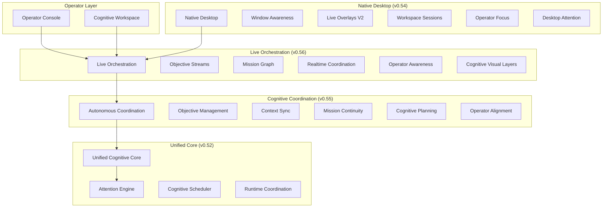

# Odin Runtime

**Local-first autonomous cognitive operating system.**

Odin Runtime is a production-grade personal cognitive operating platform — an orchestrated runtime that coordinates reasoning, memory, missions, desktop awareness, and operator supervision on your own hardware.

---

## Vision

Odin exists to give a single developer a continuously operating cognitive layer: one that remembers context across sessions, coordinates long-horizon work, surfaces unfinished missions, and assists engineering — without sending cognition to the cloud or acting without supervision.

The system is designed to feel alive: live orchestration streams, objective rivers, mission graphs, and a cinematic operator console — while remaining bounded, local, and approval-gated.

---

## What Odin Actually Is

Odin is **not** a chatbot wrapper or a single-agent demo. It is a modular runtime composed of:

- A **FastAPI cognitive backend** with 100+ specialized runtime modules
- An **Electron/React cognitive workspace** for daily operation
- An **Operator Console** for situational awareness and supervision
- A **streaming observability layer** for real-time runtime visibility
- **SQLite-backed persistence** for sessions, objectives, and mission graphs

Every capability is opt-in via environment flags. Nothing runs hidden. Nothing deploys autonomously.

---

## Core Principles

| Principle | Implementation |
|-----------|----------------|
| Local-first | All cognition, memory, and monitoring stay on-device |
| Approval-gated | Destructive actions require explicit operator approval |
| Bounded cognition | Reasoning budgets, cycle limits, throttling |
| Transparent orchestration | All monitoring is operator-visible |
| Incremental architecture | New releases extend; they do not rewrite |
| Backward compatible | Dispatcher semantics and streaming contracts preserved |

---

## System Architecture



---

## Runtime Evolution Timeline

| Version | Era | Focus |
|---------|-----|-------|
| v0.49 | Adaptive Autonomous OS | Adaptive runtime, autonomous workspace |
| v0.50 | Real Autonomous Cognitive OS | Native OS, memory fabric v2, deep focus |
| v0.51 | Cognitive Infrastructure | Realtime cognition, engineering infrastructure |
| v0.52 | Unified Cognitive Core | Attention engine, cognitive scheduler |
| v0.53 | Autonomous Overnight Cognition | Deferred reasoning, morning briefing |
| v0.54 | Native Autonomous Desktop | Window awareness, live overlays, sessions |
| v0.55 | Autonomous Cognitive Coordination | Objectives, context sync, mission continuity |
| **v0.56** | **Live Cognitive Orchestration** | Live streams, mission graph, visual layers |

---

## Cognitive Runtime Map

```
OdinApplication
├── Kernel & Missions
├── Unified Cognitive Core
├── Live Orchestration          ← v0.56
│   ├── live_orchestration
│   ├── objective_streams
│   ├── mission_graph
│   ├── realtime_coordination
│   ├── operator_situational_awareness
│   └── cognitive_visual_layers
├── Autonomous Coordination     ← v0.55
├── Native Desktop              ← v0.54
├── Overnight Cognition         ← v0.53
└── Operator Intelligence v1–v4
```

---

## Desktop Experience

Odin provides a native desktop cognition layer:

- **Window awareness** — local, exclusion-aware active window tracking
- **Live overlays** — floating HUD with focus-aware suppression
- **Workspace sessions** — SQLite-backed session restore chains
- **Operator focus** — deep work sessions with distraction pressure
- **Desktop attention** — salience scoring and surface prioritization

### Desktop Modes

| Mode | Description |
|------|-------------|
| `compact` | Minimal overlays, low-power rendering |
| `balanced` | Default daily operation |
| `immersive` | Full cognitive surfaces |
| `engineering` | Engineering-focused overlays |
| `overnight` | Bounded overnight cognition |
| `cinematic` | Visual layers at full density |

---

## Autonomous Engineering

Odin assists engineering workflows with:

- Idle engineering analysis (supervised, no auto-deploy)
- Regression risk simulation
- Technical debt tracking
- Implementation pipeline visibility
- Engineering council and review center

All engineering automation is **approval-gated**. Odin proposes; the operator approves.

---

## Overnight Cognition

When idle, Odin can run bounded overnight cognition:

- Deferred reasoning chains restored on resume
- Continuity forecasting for abandoned work
- Morning briefing generation
- Cognitive maintenance (memory compaction)
- Idle repository analysis

Limits: `ODIN_OVERNIGHT_MAX_CYCLES=32`, configurable reasoning budget. No autonomous deployment.

---

## Safety & Supervision Model

```
Operator Request
      │
      ▼
┌─────────────┐     ┌──────────────┐
│  Reasoning  │────▶│ Approval Gate │
└─────────────┘     └──────┬───────┘
                           │
              ┌────────────┼────────────┐
              ▼            ▼            ▼
          Approved     Deferred     Rejected
              │            │            │
              ▼            ▼            ▼
          Execute    Queue for     Log + notify
                     operator
```

- No unrestricted OS control
- No hidden monitoring
- No autonomous privilege escalation
- No deceptive autonomy claims

---

## Privacy & Local-First Design

| Guarantee | Detail |
|-----------|--------|
| Local processing | Window tracking, memory, objectives — all on-device |
| No cloud requirement | Mock provider works offline |
| Transparent monitoring | `monitoring_visible: true` on all awareness runtimes |
| Configurable exclusions | Window and workspace exclusion lists |
| Bounded retention | SQLite stores capped (200 objectives, 300 graph nodes) |

---

## Installation

### Prerequisites

- Python 3.11+
- Node.js 18+
- Redis (optional, for pub/sub)
- 16 GB RAM recommended

### Clone

```bash
git clone https://github.com/FrostXMello/odin-runtime.git
cd odin-runtime/odin
cp backend/.env.example backend/.env
```

### Backend

```powershell
.\scripts\start-backend.ps1
```

API docs: http://127.0.0.1:8000/docs

### Frontend

```powershell
.\scripts\start-frontend.ps1
```

### Operator Console

```powershell
cd operator
npm install
npm run dev
```

---

## Quick Start

1. Enable core flags in `backend/.env`:

```env
ODIN_LIVE_ORCHESTRATION_ENABLED=1
ODIN_OBJECTIVE_STREAMS_ENABLED=1
ODIN_MISSION_GRAPH_ENABLED=1
ODIN_NATIVE_DESKTOP_ENABLED=1
ODIN_AUTONOMOUS_COORDINATION_ENABLED=1
```

2. Start backend and operator console
3. Open `/live-orchestration` in the operator console
4. Stream orchestration state via `POST /api/v1/runtime/live-orchestration/stream`

---

## Running the Cognitive Workspace

The cognitive workspace (`frontend/cognitive_workspace/`) provides:

- Live orchestration HUD
- Runtime constellation map
- Objective river renderer
- Cognition pulse visualizer

Profiles: `compact`, `balanced`, `immersive`, `cinematic`, `overnight_autonomous`

---

## Operator Console

200+ pages for runtime visibility. Key surfaces:

| Page | Purpose |
|------|---------|
| `/live-orchestration` | Real-time orchestration health |
| `/objective-streams` | Live objective progression |
| `/mission-graph` | Mission dependency graph |
| `/operator-awareness` | Situational brief |
| `/runtime-constellation` | Cinematic runtime map |
| `/cognition-pulse` | Live cognition pulse |

---

## Native Desktop Layer

See `docs/NATIVE_DESKTOP_RUNTIME.md`. Key APIs:

- `GET /api/v1/runtime/native-desktop/status`
- `GET /api/v1/runtime/window-awareness/active`
- `POST /api/v1/runtime/workspace-sessions/save`

---

## Streaming & APIs

### Channels (v0.56)

| Channel | Runtime |
|---------|---------|
| `live-orchestration:runtime` | Live orchestration state |
| `objective-streams:runtime` | Objective progression |
| `mission-graph:runtime` | Graph linkage events |
| `realtime-coordination:runtime` | Stream multiplexing |
| `operator-awareness:runtime` | Operator briefs |
| `visual-layers:runtime` | Visual rendering |

### Example

```bash
curl http://127.0.0.1:8000/api/v1/runtime/live-orchestration/health
curl -X POST http://127.0.0.1:8000/api/v1/runtime/mission-graph/link \
  -H "Content-Type: application/json" \
  -d '{"src": "feature-auth", "dst": "feature-api"}'
```

Full API reference: http://127.0.0.1:8000/docs

---

## Hardware Profiles

| Profile | GPU | RAM | Notes |
|---------|-----|-----|-------|
| Minimum | GTX 1650 Ti | 16 GB | `compact` profile, adaptive rendering |
| Recommended | RTX 3060+ | 32 GB | `balanced` / `immersive` |
| Apple Silicon | M-series | 16 GB | `balanced`, low-power cinematic |

Adaptive render scaling, graph virtualization, and orchestration throttling ensure bounded resource use.

---

## Screenshots / Visual Placeholders

> Screenshots coming soon. Placeholder regions:

| Surface | Path |
|---------|------|
| Live Orchestration HUD | `frontend/cognitive_workspace/src/live_orchestration/` |
| Runtime Constellation | `/runtime-constellation` operator page |
| Objective River | `/objective-river` operator page |
| Mission Graph | `/mission-graph` operator page |

---

## Feature Matrix

| Feature | v0.54 | v0.55 | v0.56 |
|---------|-------|-------|-------|
| Native desktop | ✅ | ✅ | ✅ |
| Objective trees | — | ✅ | ✅ |
| Live orchestration streams | — | — | ✅ |
| Mission graph | — | — | ✅ |
| Cinematic visual layers | — | — | ✅ |
| Operator situational awareness | — | — | ✅ |

### Cognition Modes

| Mode | Budget | Use Case |
|------|--------|----------|
| `compact` | Low | Background, low-power |
| `balanced` | Medium | Daily development |
| `engineering` | High | Active coding sessions |
| `immersive` | High | Deep work |
| `overnight_autonomous` | Bounded | Idle overnight cycles |

---

## Project Structure

```
odin/
├── backend/
│   ├── odin_backend/
│   │   ├── core/              # 100+ runtime modules
│   │   ├── api/routes/        # FastAPI route modules
│   │   └── config.py          # Environment-driven settings
│   ├── tests/                 # 30,000+ generated tests
│   └── scripts/               # Bootstrap and test generators
├── frontend/
│   └── cognitive_workspace/   # React cognitive UI
├── operator/                  # Next.js operator console
├── docs/                      # Runtime documentation
└── infrastructure/            # Docker, Redis
```

---

## Development Workflow

```powershell
# Generate tests for a prompt
python backend/scripts/gen_p56_tests.py

# Run smoke tests (fast)
python -m pytest backend/tests/test_live_orchestration_integration_p56.py -k "not bulk"

# Incremental commits by subsystem
git add backend/odin_backend/core/live_orchestration
git commit -m "feat(live-orchestration): add live orchestration runtime"
```

---

## Roadmap

| Version | Focus |
|---------|-------|
| v0.57 | Federated mission graphs across workspaces |
| v0.58 | Predictive orchestration with interruption windows |
| v0.59 | Multi-operator coordination (team mode) |
| v0.60 | Unified cinematic dashboard |

---

## Contributing

1. Fork the repository
2. Create a feature branch from `master`
3. Follow incremental extension — do not rewrite dispatcher semantics
4. Add tests via `gen_p{N}_tests.py` pattern
5. Document in `docs/`
6. Submit a pull request

---

## License

See [LICENSE](LICENSE) in the repository root.

---

<p align="center">
  <strong>Odin Runtime v0.56</strong> — Live Cognitive Orchestration<br>
  Local-first · Approval-gated · Operator-supervised
</p>
