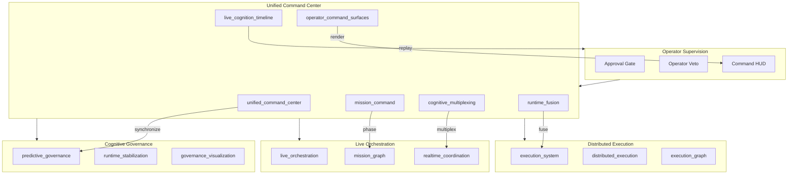
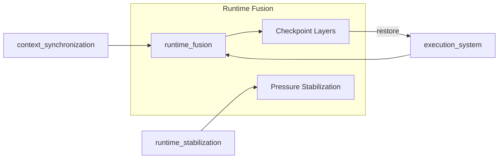
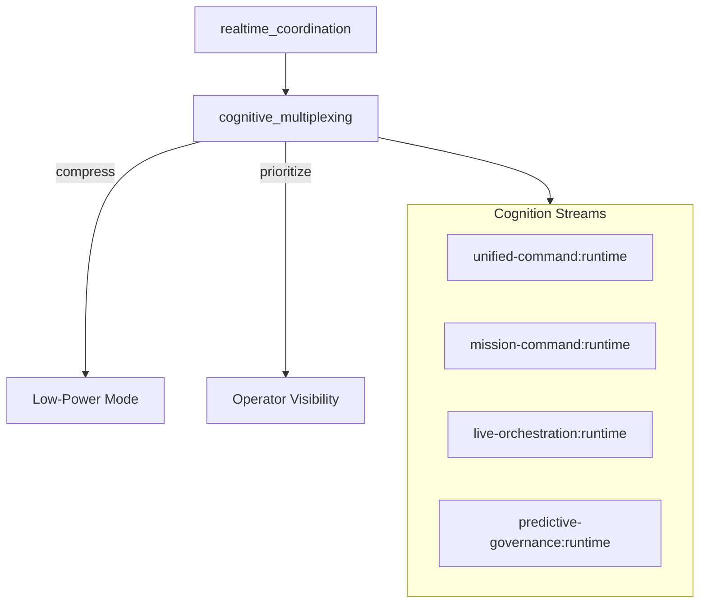
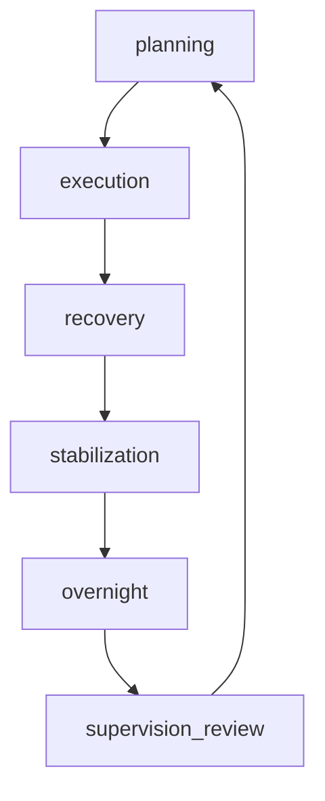
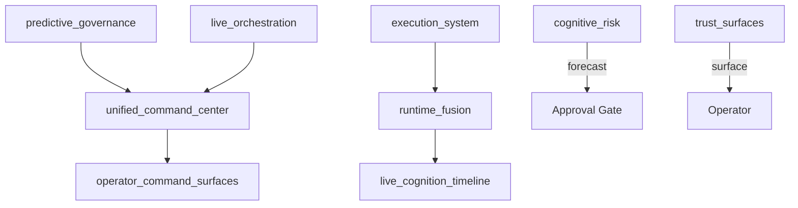
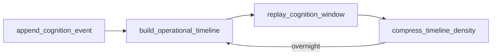
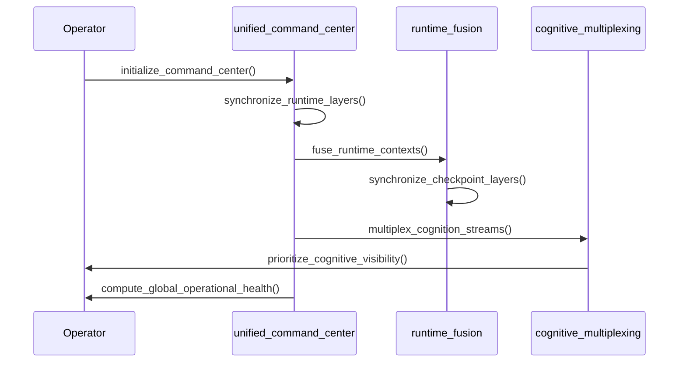
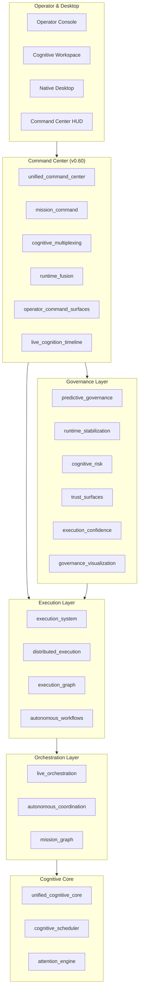

# Odin Runtime

**A supervised cognitive command infrastructure for autonomous engineering, orchestration, governance, and persistent desktop cognition.**

Odin Runtime is a local-first cognitive command platform — a unified stack of 136+ runtime modules that converge orchestration, execution, governance, memory, missions, and desktop awareness into one continuously operating mission control system on your own hardware.

---

## Vision

Odin gives a single developer a continuously operating cognitive command layer: one that remembers context across sessions, coordinates long-horizon work across multiple workspaces, executes supervised engineering pipelines, governs cognition, and renders a unified operational cockpit — without cloud dependency or unsupervised autonomy.

The system is designed to feel like mission control: live orchestration, execution DAGs, governance HUDs, cognition rivers, and cinematic command surfaces — while remaining bounded, reversible, approval-gated, and operator-supervised.

---

## Why Odin Exists

Most AI tooling is ephemeral: chat sessions vanish, context resets, execution is opaque, and autonomy is either absent or unrestricted. Odin bridges that gap with:

- **Persistent cognition** — sessions, objectives, mission graphs, execution memory, cognition timelines
- **Supervised execution** — reversible pipelines, checkpoints, rollback graphs
- **Governed autonomy** — predictive stabilization, risk forecasting, trust surfaces
- **Unified command center** — orchestration + execution + governance convergence
- **Desktop integration** — window awareness, overlays, workspace sessions
- **Operator sovereignty** — every action is visible, approval-gated, and reversible

---

## Core Principles

| Principle | Implementation |
|-----------|----------------|
| Local-first | All cognition, memory, governance, and monitoring stay on-device |
| Approval-gated | Destructive actions require explicit operator approval |
| Bounded cognition | Reasoning budgets, cycle limits, throttling, cooldowns |
| Transparent governance | All risk, trust, and confidence scoring is operator-visible |
| Reversible execution | Checkpoints, rollback graphs, execution replay chains |
| Incremental architecture | New releases extend; they do not rewrite |
| Backward compatible | Dispatcher semantics and streaming contracts preserved |

---

## Unified Command Center Architecture (v0.60)



No unrestricted autonomy. No hidden execution. No self-authoritative governance. No autonomous deployment.

---

## Command Center Modules

| Module | App Handle | Role |
|--------|-----------|------|
| `unified_command_center` | `app.unified_command_center` | Global coordination, health tracking, pressure balancing |
| `mission_command` | `app.mission_command` | Mission-centric cognition, phase transitions, objective federation |
| `cognitive_multiplexing` | `app.cognitive_multiplexing` | Unified cognition streams, compression, prioritization |
| `runtime_fusion` | `app.runtime_fusion` | Cross-runtime state fusion, checkpoint convergence |
| `operator_command_surfaces` | `app.operator_command_surfaces` | Command HUD, cinematic overlays, visual density |
| `live_cognition_timeline` | `app.live_cognition_timeline` | Cognition playback, mission timeline, replay chains |

---

## Runtime Fusion Topology



Cross-runtime state fusion converges orchestration, execution, and governance contexts into synchronized checkpoint layers. Reversible restoration preserves operator control.

---

## Cognition Multiplexing Flow



Adaptive cognition density scaling with stream prioritization under load. Bounded multiplex loops (max 64).

---

## Mission DAG Example



Mission command manages phase transitions with DAG virtualization (500 node cap). All transitions are operator-controlled.

---

## Governance + Execution Convergence



Governance and execution layers converge through the unified command center without bypassing approval gates or supervision.

---

## Operational Continuity Replay Chain



SQLite-backed cognition timeline (max 500 events). Bounded replay loops (max 40). Overnight timeline compression.

---

## Unified Stream Topology

```
runtime (global)
├── unified-command:runtime
├── mission-command:runtime
├── cognitive-multiplexing:runtime
├── runtime-fusion:runtime
├── operator-command-surfaces:runtime
├── live-cognition-timeline:runtime
├── predictive-governance:runtime
├── distributed-execution:runtime
├── live-orchestration:runtime
└── ... (56+ domain channels)
```

Events flow through `resolve_channels_for_trace()` without breaking dispatcher semantics.

---

## Synchronization Lifecycle



Adaptive synchronization throttling with runtime fusion cooldowns (max 48 loops).

---

## Local-First Architecture

| Guarantee | Detail |
|-----------|--------|
| On-device processing | Cognition, memory, governance, window tracking |
| No cloud requirement | Mock provider works fully offline |
| Transparent monitoring | All awareness runtimes expose `operator_visible: true` |
| Configurable exclusions | Window and workspace exclusion lists |
| Bounded retention | SQLite stores capped per subsystem |
| Reversible state | Checkpoints across execution, governance, and workflows |

---

## Runtime Evolution Timeline

| Version | Era | Focus |
|---------|-----|-------|
| v0.49 | Adaptive Autonomous OS | Adaptive runtime, autonomous workspace |
| v0.50 | Real Autonomous Cognitive OS | Native OS, memory fabric v2 |
| v0.51 | Cognitive Infrastructure | Realtime cognition, engineering infra |
| v0.52 | Unified Cognitive Core | Attention engine, cognitive scheduler |
| v0.53 | Autonomous Overnight Cognition | Deferred reasoning, morning briefing |
| v0.54 | Native Autonomous Desktop | Window awareness, live overlays |
| v0.55 | Autonomous Cognitive Coordination | Objectives, context sync |
| v0.56 | Live Cognitive Orchestration | Live streams, mission graph |
| v0.57 | Operational Execution System | Supervised pipelines, agent collaboration |
| v0.58 | Distributed Cognitive Execution | Multi-workspace DAG federation |
| v0.59 | Predictive Cognitive Governance | Risk forecasting, trust surfaces, stabilization |
| **v0.60** | **Unified Cognitive Command Center** | Mission control, runtime fusion, cognition multiplexing |

---

## Full System Architecture



---

## Cognitive Governance Layer

| Module | App Handle | Role |
|--------|-----------|------|
| `predictive_governance` | `app.predictive_governance` | Governance cycles, pressure balancing |
| `runtime_stabilization` | `app.runtime_stabilization` | Instability suppression, cooldowns |
| `cognitive_risk` | `app.cognitive_risk` | Risk forecasting, failure simulation |
| `trust_surfaces` | `app.trust_surfaces` | Operator trust, supervision integrity |
| `execution_confidence` | `app.execution_confidence` | Confidence scoring, workflow probability |
| `governance_visualization` | `app.governance_visualization` | Governance HUD, risk heatmaps |

---

## Distributed Execution Layer

- **Execution system** — supervised pipelines with reversible checkpoints
- **Execution graph** — SQLite DAG registry with rollback graphs
- **Distributed execution** — cross-workspace pipeline federation
- **Predictive recovery** — blocker forecasting and recovery simulation
- **Autonomous workflows** — bounded supervised automation loops (max 48 cycles)

---

## Desktop Cognition Surfaces

- Window awareness (local, exclusion-aware)
- Live overlays v2 (adaptive throttling)
- Workspace sessions (SQLite restore chains)
- Operator focus (distraction pressure)
- Desktop attention (salience scoring)
- Command center HUD (cinematic operational rendering)

---

## Overnight Cognition

Bounded overnight cycles with deferred reasoning, continuity forecasting, morning briefing, and cognitive maintenance. Limits: `ODIN_OVERNIGHT_MAX_CYCLES=32`. No autonomous deployment.

---

## Mission Orchestration

Objective trees, mission graphs, mission command phases, resume chains, and continuity scoring across sessions. All mission state is supervised and locally persisted.

---

## Operator Supervision Model

```
Cognition → Command Center → Governance Check → Risk Forecast → Trust Surface
                                    │
                                    ▼
                            Approval Gate
                                    │
                    ┌───────────────┼───────────────┐
                    ▼               ▼               ▼
                Execute         Defer           Reject
                    │               │               │
                    ▼               ▼               ▼
              Checkpoint      Queue           Log + Notify
```

---

## Performance Profiles

| Profile | Cognition | Rendering | Use Case |
|---------|-----------|-----------|----------|
| `compact` | Low | Minimal | Background, low-power |
| `balanced` | Medium | Adaptive | Daily development |
| `engineering_operations` | High | Standard | Active coding |
| `immersive` | High | Full | Deep work |
| `cinematic` | High | Maximum | Visual surfaces |
| `overnight_command` | Bounded | Low-power | Idle command center cycles |

---

## Hardware Targets

| Profile | GPU | RAM | Recommended Mode |
|---------|-----|-----|------------------|
| Minimum | GTX 1650 Ti | 16 GB | `compact` / `balanced` |
| Recommended | RTX 3060+ | 32 GB | `balanced` / `immersive` |
| Apple Silicon | M-series | 16 GB | `balanced` |

Adaptive synchronization throttling, lazy HUD hydration, bounded replay loops, and low-power cinematic mode ensure operation within constraints.

---

## Installation

### Prerequisites

- Python 3.11+
- Node.js 18+
- Redis (optional)
- 16 GB RAM recommended

```bash
git clone https://github.com/FrostXMello/odin-runtime.git
cd odin-runtime/odin
cp backend/.env.example backend/.env
```

### Backend

```powershell
.\scripts\start-backend.ps1
```

API docs: http://127.0.0.1:8000/docs

### Operator Console

```powershell
cd operator
npm install
npm run dev
```

---

## Quick Start

```env
# Enable command center + governance + execution core
ODIN_UNIFIED_COMMAND_CENTER_ENABLED=1
ODIN_MISSION_COMMAND_ENABLED=1
ODIN_COGNITIVE_MULTIPLEXING_ENABLED=1
ODIN_RUNTIME_FUSION_ENABLED=1
ODIN_OPERATOR_COMMAND_SURFACES_ENABLED=1
ODIN_LIVE_COGNITION_TIMELINE_ENABLED=1
ODIN_PREDICTIVE_GOVERNANCE_ENABLED=1
ODIN_EXECUTION_SYSTEM_ENABLED=1
ODIN_LIVE_ORCHESTRATION_ENABLED=1
```

1. Start backend and operator console
2. Open `/unified-command` for mission control dashboard
3. Open `/mission-command` for mission phase tracking
4. Stream command events on `unified-command:runtime`

---

## Environment Configuration

See `backend/.env.example` for all flags. Key command center flags:

```env
ODIN_UNIFIED_COMMAND_CENTER_ENABLED=1
ODIN_MISSION_COMMAND_ENABLED=1
ODIN_COGNITIVE_MULTIPLEXING_ENABLED=1
ODIN_RUNTIME_FUSION_ENABLED=1
ODIN_OPERATOR_COMMAND_SURFACES_ENABLED=1
ODIN_LIVE_COGNITION_TIMELINE_ENABLED=1
ODIN_COMMAND_PROFILE=balanced
ODIN_COGNITION_MULTIPLEX_MODE=adaptive
ODIN_OPERATIONAL_CONTINUITY_MODE=balanced
```

---

## API Structure

```
/api/v1/runtime/
├── unified-command/           # Command center coordination
├── mission-command/           # Mission-centric cognition
├── cognitive-multiplexing/    # Cognition stream multiplexing
├── runtime-fusion/            # Cross-runtime state fusion
├── operator-command-surfaces/ # Command HUD rendering
├── live-cognition-timeline/   # Cognition playback
├── operational-health/        # Global health tracking
├── global-pressure/           # Pressure balancing
├── predictive-governance/     # Governance cycles
├── execution-system/          # Supervised pipelines
├── live-orchestration/        # Live orchestration
└── ... (110+ route groups)
```

---

## Operator Console

260+ pages for runtime visibility. Key command center surfaces:

| Page | Purpose |
|------|---------|
| `/unified-command` | Unified mission control dashboard |
| `/mission-command` | Mission-centric cognition |
| `/mission-phases` | Operational phase transitions |
| `/cognitive-multiplexing` | Cognition stream multiplexing |
| `/runtime-fusion` | Cross-runtime state fusion |
| `/command-surfaces` | Unified command HUD |
| `/operational-health` | Global operational health |
| `/global-pressure` | Command pressure balancing |
| `/live-cognition-timeline` | Cognition timeline playback |
| `/cognition-replay` | Bounded cognition replay |

---

## Safety Guarantees

| Guarantee | Enforcement |
|-----------|-------------|
| No hidden execution | All runtimes return `transparent: true` |
| No auto-deploy | `no_auto_deploy: true` on workflows |
| Approval-gated | `approval_gated: true` on execution and simulation |
| Reversible | Checkpoints, rollback graphs, replay chains |
| Bounded cycles | Max limits on loops, streams, simulations |
| Operator override | `operator_override: true` on alignment and intervention |
| Local-only | `local_first: true` on awareness and federation |

---

## Scaling Constraints

- Adaptive cognition density scaling
- Stream prioritization under load
- Mission DAG virtualization (500 node cap)
- Replay compression for overnight timelines
- Low-power operational rendering
- Bounded synchronization loops (max 48)
- Visual density throttling (max 56 renders)
- Lazy HUD hydration
- Runtime fusion cooldowns
- Cognition stream compression
- SQLite retention limits per subsystem

---

## Runtime Feature Matrix

| Feature | v0.57 | v0.58 | v0.59 | v0.60 |
|---------|-------|-------|-------|-------|
| Supervised execution | ✅ | ✅ | ✅ | ✅ |
| Distributed DAG | — | ✅ | ✅ | ✅ |
| Predictive governance | — | — | ✅ | ✅ |
| Unified command center | — | — | — | ✅ |
| Mission command | — | — | — | ✅ |
| Runtime fusion | — | — | — | ✅ |
| Cognition multiplexing | — | — | — | ✅ |
| Live cognition timeline | — | — | — | ✅ |

---

## Roadmap (v0.61+)

| Version | Focus |
|---------|-------|
| v0.61 | Closed-loop predictive recovery with operator veto gates |
| v0.62 | Multi-operator collaborative cognition |
| v0.63 | Real-time rollback DAG animation engine |
| v0.64 | Federated cognition across opt-in workspaces |
| v0.65 | Unified cinematic operational desktop |

---

## Contributing

1. Fork the repository
2. Create a feature branch from `master`
3. Extend incrementally — do not rewrite dispatcher semantics
4. Add tests via `gen_p{N}_tests.py` pattern
5. Document in `docs/`
6. Submit a pull request

---

## License

See [LICENSE](LICENSE) in the repository root.

---

<p align="center">
  <strong>Odin Runtime v0.60</strong> — Unified Cognitive Command Center<br>
  Local-first · Approval-gated · Operator-supervised · Mission Control
</p>
